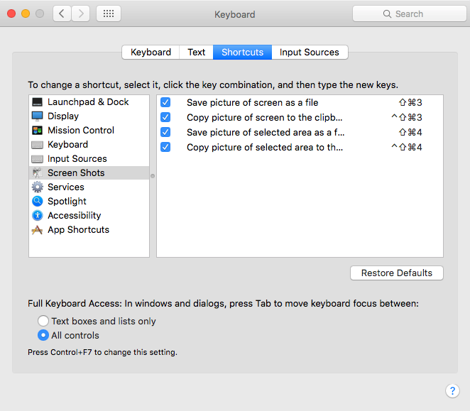

# osx 上常用的图片相关的工具

 关于图片我们一般常见的操作都有哪些呢？首先想到的大概就是

1. 截图
2. 图片剪裁
3. 图片大小压缩
4. 图片批量重命名
5. Gif 录制
6. icon 生成
7. 图片拼接

1. 说到截图，自然想到的是系统自带的截图和QQ的截图。系统自带好在不以来任何第三方软件。
   
    
   
   QQ自带截图（ ⌘+ ⌃ +A）简单够用，加上 Windows 时代形成的习惯，成为了很多人的选择。如果需要诸如局部马赛克，添加图片挂件就需要 Annotate 或者 「截图」这样的 App 了。大部分的场景下我们截图发给朋友或者发推不希望在本地留下一个文件事后还要删除，所以QQ自带截图和Annotate以及「截图」
   
   腾讯的 snip 可以滚动截图，比如QQ，Telegram 的聊天记录，网页滚动截图等。
   
2. 图片裁剪不同于截图，是指从 Finder 中选取一张图片进行编辑，自带的 Preview 也挺强大的。大部分的工作都能胜任。
   
3. 图片大小压缩
   
   Reduce Image Size
   
   JPEGmini (Lite)
   
   PPDuck
   
   等都是通过软件算法在尽量不降低图片清晰度的情况下，减小图片的占用空间，这一点在移动端挺需要的，可以减少占用空间和网络传输流量。
   
4. 图片批量重命名
   
   Better Finder Renamer 不二自选
   
5. Gif 制作
   
   Lcecap 小巧精悍。
   
   Annotate 也可以录 gif 不过最多只能录 15s 不知道什么逻辑...
   
   Gif-Creator 可以把本地的多张图片做成一张 gif
   
   Interval 这是可以把多张图片合成一个 mp4 文件
   
6. icon 生成
   
   iconkit 可以把一张图片生成各种尺寸，适合各种设备的 icon
   
   Eicon 可以把一张图片快速生成诸如`16*16, 128*128`等各种尺寸的正方形
   
7. 图片拼接
   
   MagicCollageLite
   
   TurboCollage
   
   没有找到那种只是把两张图（或多张图）横排，竖排的非联网的小工具，有机会学了 OSX开发自己写一个把😂

​

​